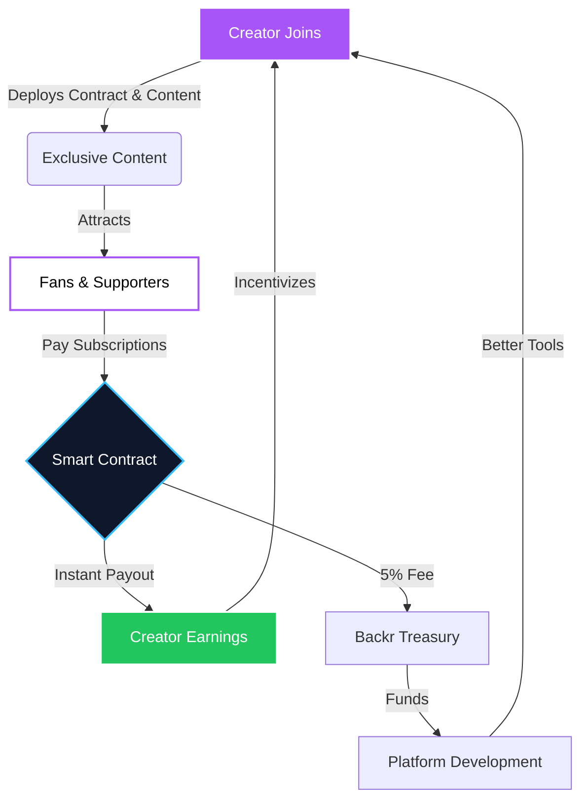
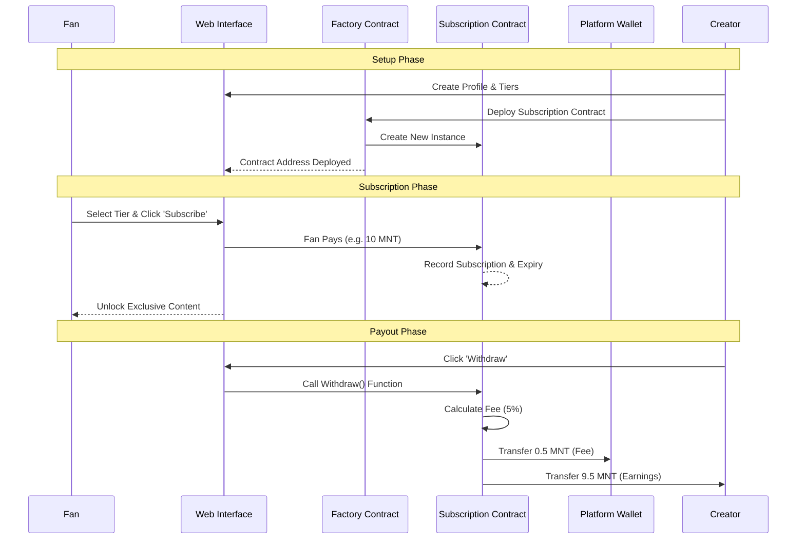
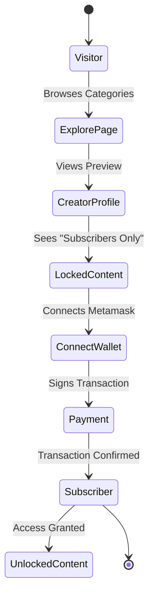

# Backr - Visual Pitch Schemas

Here are the visual representations of the Backr platform mechanics, business model, and user journey. These diagrams can be included in the "How It Works" and "Business Model" slides.

## 1. The Core Value Loop (Flywheel)
*How the platform grows organically.*



---

## 2. Technical Architecture & Money Flow
*How funds move trustlessly from fan to creator.*



---

## 3. The "Unfair Advantage" Comparison
*Why Backr is superior to Web2 alternatives.*

```mermaid
quadrantChart
    title Decentralization vs. Payout Speed
    x-axis Centralized --> Decentralized
    y-axis Slow Payouts --> Instant Payouts
    quadrant-1 Backr (Ideal)
    quadrant-2 Niche Crypto Tools
    quadrant-3 Patreon / YouTube
    quadrant-4 OnlyFans / Substack
    "Patreon": [0.2, 0.3]
    "Substack": [0.25, 0.35]
    "YouTube": [0.15, 0.25]
    "Backr": [0.9, 0.95]
```

---

## 4. User Journey Map
*From visitor to paid subscriber.*


